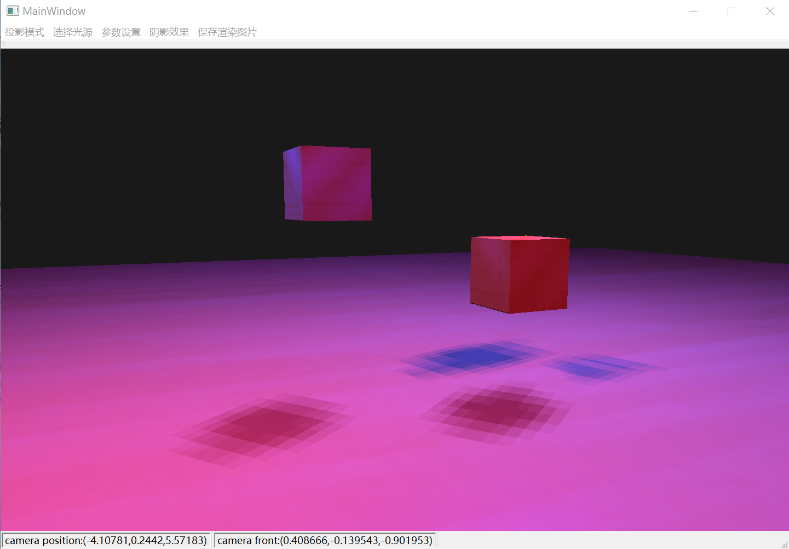
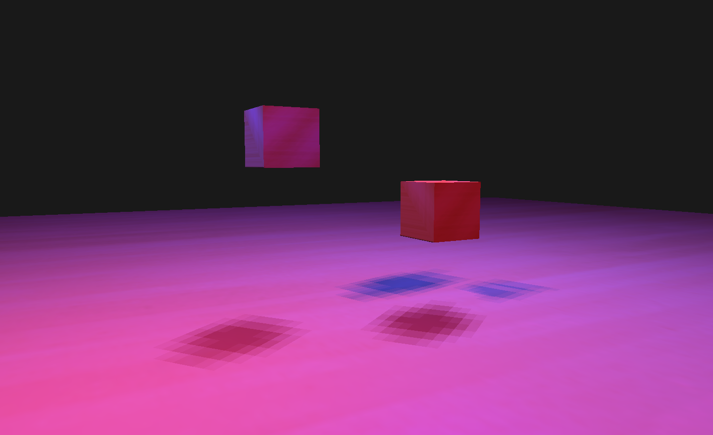
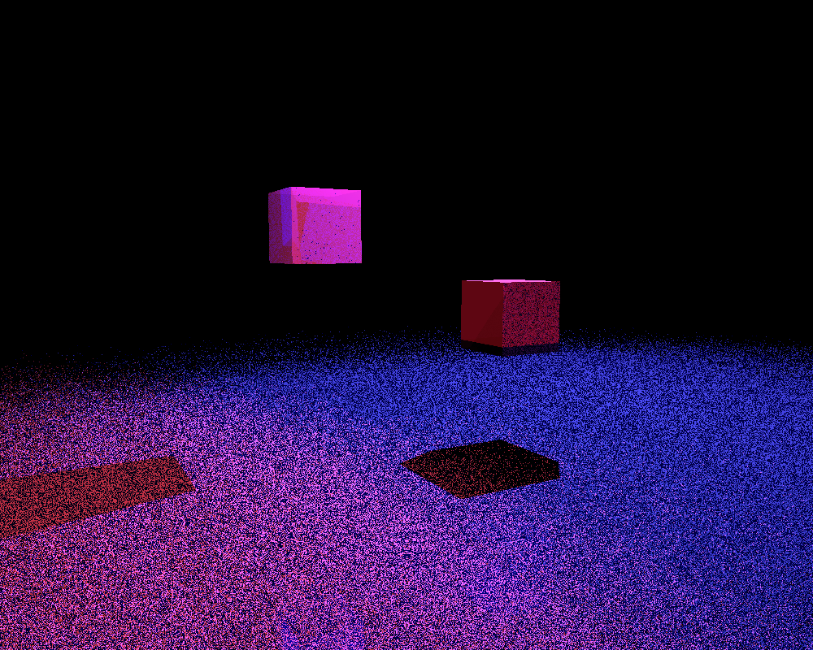

# Rover




## 功能

这是一个带有图形界面的场景漫游器，支持：

- [x] 自定义场景 (物体、光照、相机)
- [x] phong光照明模型
- [x] 场景漫游
- [x] 基础的光线追踪
- [x] 相机参数设定
- [x] 透视投影和平行投影的切换
- [x] 点光源
- [x] 平行光源
- [x] 多光源组合
- [x] 选择无阴影/阴影映射
- [ ] 点阴影
- [x] obj模型
- [ ] 光线追踪从纹理图采样
- [x] 基于AABB的碰撞检测和光线追踪加速
- [x] 保存渲染图片


## 环境

- 操作系统：windows 10
- 开发环境: Qt5


## 配置场景描述文件

场景描述文件在./scene/scene.json，其中定义了相机位置、姿态、参数，光源信息，模型信息。

一个典型的场景描述文件：

```json
{
    "camera_farplane": 100,
    "camera_focalDistance": 0.5,
    "camera_nearDistance": 0.1,
    "camera_nearplane": 0.1,
    "camera_pitch": 0,
    "camera_position": {
        "x": 0,
        "y": 0,
        "z": 3
    },
    "camera_up": {
        "x": 0,
        "y": 1,
        "z": 0
    },
    "camera_yaw": -90,
    "camera_zoom": 45,
    "lights": [
        {
            "light_color": {
                "x": 1,
                "y": 1,
                "z": 1
            },
            "light_position": {
                "x": 2,
                "y": 4,
                "z": -1.5
            },
            "type": 1
        },
        {
            "light_color": {
                "x": 1,
                "y": 1,
                "z": 1
            },
            "light_direction": {
                "x": 1.0,
                "y": 0,
                "z": 0
            },
            "type": 2 
        }
    ],
    "models": [
        {
            "ka": {
                "x": 0.0,
                "y": 0.0,
                "z": 0.4
            },
            "ks": {
                "x": 0.0,
                "y": 0.0,
                "z": 0.6
            },
            "kt": {
                "x": 0.0,
                "y": 0.0,
                "z": 0.4
            },
            "modelMatrix": [
                20.0,
                0,
                0,
                0,
                0,
                20.0,
                0,
                0,
                0,
                0,
                20.0,
                0,
                0,
                -2,
                0,
                1
            ],
            "n": 16,
            "path": "./texture/plane.obj",
            "type": 1
        },
        {
            "ka": {
                "x": 0.6,
                "y": 0.6,
                "z": 0.6
            },
            "ks": {
                "x": 0.6,
                "y": 0.6,
                "z": 0.6
            },
            "kt": {
                "x": 0.1,
                "y": 0.1,
                "z": 0.1
            },
            "modelMatrix": [
                0.8,
                0,
                0,
                0,
                0,
                0.8,
                0,
                0,
                0,
                0,
                0.8,
                0,
                -2,
                0.5,
                -1,
                1
            ],
            "n": 16,
            "path": "./texture/cube.obj",
            "type": 1
        }
    ]
}
```

需要注意的是，其中的光照参数 $K_a,K_s,n,K_t$ 只应用于光线追踪算法；如果需要改变OpenGL渲染场景的参数，需要在菜单栏的**参数设置**中选择**设定Phong模型参数**，此时只能设置**全局的相对参数**。


## 交互方式

移动相机位置：

- 键盘W: 前进
- 键盘S: 后退
- 键盘A: 左移
- 键盘D: 右移
- 键盘Q: 上移
- 键盘E: 下移

改变相机姿态：

- 按下鼠标左键进行拖动。

选择光源：

- 在菜单栏的**选择光源**中从场景文件定义的光源中选择任意多个光源，这些光源会被设置为有效，其他光源被设置为无效。

更改模式和相机参数：

- 在菜单栏的**投影模式**中选择**透视投影**或者**平行投影**。
- 在菜单栏的**参数设置**中选择**设定相机参数**，在对话框中设置frustum的near_plane, far_plane以及移动速度。
- 在菜单栏的**参数设置**中选择**重置相机姿态**，相机回到初始姿态。

设置Phong模型相对参数：

- 在菜单栏的**参数设置**中选择**设定Phong模型参数**，这些参数并非绝对数值，而是相对于纹理数值的比例系数，且参数是全局的。

保存渲染结果：

- 在菜单栏的**保存渲染图片**中选择保存OpenGL渲染结果或光线追踪算法的渲染结果。

查看当前相机姿态：

- 底部状态栏显示了当前相机的坐标以及正面朝向。


## 算法

1. 基于OpenGL和Qt的Phong光照模型+阴影

   - 单光源：对于平行光源，在非常远的位置放置一个点光源进行模拟。
   - 阴影映射：在正式渲染之前，设置相机在光源处预先渲染一遍得到光源处的深度缓冲。
   - 点阴影：创建CUBE_MAP，在6个方向上分别计算深度值。

   

2. 光线追踪

   - 多光源
   - 计算每个model以及包含的mesh的AABB，对求交判断进行加速。

   


## 代码结构

```c++
-- src
| -- raytracing/basic.h  		// basic mathematics in ray tracing
| -- aabb.h, aabb.cpp			// abstraction of AABB
| -- camera.h, camera.cpp 		// abstraction of camera
| -- geometry.h, geometry.cpp 	// geometry in ray tracing
| -- global.h, glocal.cpp 		// default parameters
| -- light.h 					// abstraction of light
| -- locallighting.h, locallighting.cpp // phong lighting used in ray tracing
| -- main.cpp 					// qt main function
| -- mainwindow.h, mainwindow.cpp, mainwindow.ui // qt mainwindow
| -- mesh.h, model.h, objmodel.h	// data structure for .obj model
| -- openglscene.h, openglscene.cpp		// opengl rendering pipeline
| -- paramdialog.h, paramdialog.cpp, paramdialog.ui		// parameter dialog
| -- raytracingdialog.h, raytracingdialog.cpp, raytracingdialog.ui // ray tracing config dialog
| -- raytracingscene.h, raytracingscene.cpp		// ray tracing rendering pipeline
| -- scene.h, scene.cpp			// abstraction of scene
| -- stb_image.h				// external library for reading texture
```


## 引用

obj模型操作参考了[mesh.h](https://learnopengl.com/code_viewer_gh.php?code=includes/learnopengl/mesh.h)和[model.h](https://learnopengl.com/code_viewer_gh.php?code=includes/learnopengl/model.h), 在其上增加了对AABB和光线追踪的支持。

opengl的相机参考了[camera.h](https://learnopengl.com/code_viewer_gh.php?code=includes/learnopengl/camera.h)。